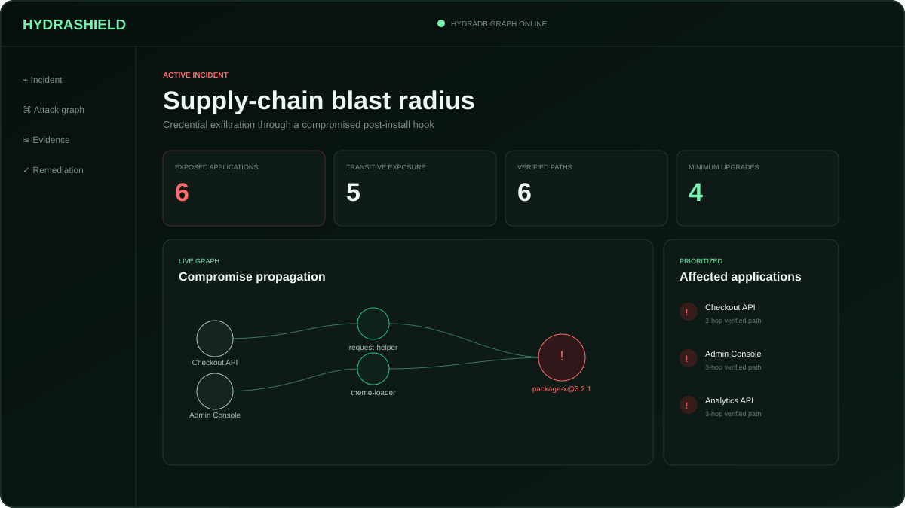
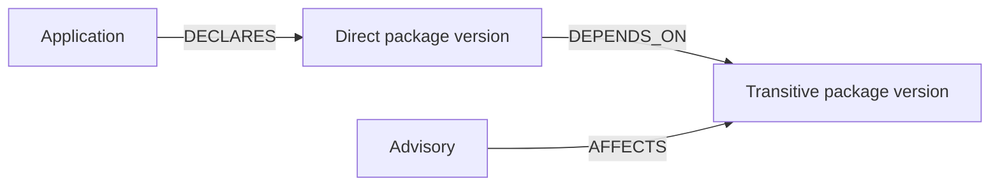

# HydraShield

**Graph-native software supply-chain blast-radius analysis, powered by HydraDB OSS.**

HydraShield answers the question security teams face when an npm package is compromised:

> Which applications are exposed, through which exact dependency paths, and what is the smallest remediation plan that cuts every known path?

This project is an entry for **Hack Hydra — Track 02A: Supply Chain Blast Radius**. HydraDB is the authoritative graph and traversal engine. It stores applications, package versions, advisories and dependency relationships, then performs the multi-hop queries that produce every exposure claim.



## What works

- npm `package-lock.json` v2/v3 ingestion
- OSV-format advisory ingestion with exact affected versions
- Exact direct and transitive exposure detection
- Complete evidence paths from application to compromised package
- Environment-aware prioritization
- Greedy graph-cut remediation recommendations
- Deterministic abstention for unknown advisories
- Six-minute compromise replay dashboard
- HydraDB OSS adapter using authenticated HTTP/OpenCypher
- Zero-cloud preview adapter for tests and UI development
- One-command correctness benchmark

## Why a graph database

A package name search can find direct references. It cannot reliably calculate the reverse transitive closure across package versions, lockfiles, services and deployments. HydraShield models that topology explicitly:



The HydraDB adapter generates bounded exact path queries from depth 0 through 12. All application exposure claims require a real path from `Application` through `DEPENDS_ON` edges to a `PackageVersion` connected to the advisory by `AFFECTS`.

## Fast preview

Python 3.11+ is the only requirement:

```bash
make test
make demo
```

Open `http://127.0.0.1:8080`. The preview uses the deterministic in-memory adapter but otherwise runs the same ingestion, analysis, remediation and API code as the HydraDB configuration.

## Run fully on HydraDB OSS

Docker is the fastest route:

```bash
make init-hydradb
UID=$(id -u) GID=$(id -g) docker compose up --build
```

Open `http://127.0.0.1:8080`. The application container is configured with `HYDRASHIELD_GRAPH_BACKEND=hydradb`, so graph mutations and path analysis execute against the local HydraDB node.

To run the application outside Compose against an already-running node:

```bash
export HYDRASHIELD_GRAPH_BACKEND=hydradb
export HYDRADB_URL=http://127.0.0.1:8443
export HYDRADB_TOKEN=local-development-token-32-bytes
export PYTHONPATH=backend
python -m hydrashield.api --demo
```

### Verify the active backend

```bash
curl http://127.0.0.1:8080/api/health
```

Expected HydraDB response:

```json
{"status":"ok","backend":"HydraDBGraph"}
```

### Strict Docker boot test

```bash
make docker-boot-test
```

This test pulls HydraDB OSS, builds HydraShield, waits for both services, and
fails unless the application reports `HydraDBGraph`, the seeded incident
returns all six exact evidence paths, and the node returns the expected graph
counts. The same test runs in GitHub Actions on every push and pull request.

## API

### Analyze the seeded incident

```bash
curl 'http://127.0.0.1:8080/api/overview?advisory_id=GHSA-HYDRA-2026-0001'
```

### Import a package lock

```bash
curl -X POST http://127.0.0.1:8080/api/ingest/package-lock \
  -H 'Content-Type: application/json' \
  --data '{
    "application": {
      "id": "checkout-api",
      "name": "Checkout API",
      "environment": "production",
      "repository": "acme/checkout-api",
      "criticality": "critical"
    },
    "lockfile": {"lockfileVersion": 3, "packages": {"": {}}}
  }'
```

### Import an OSV advisory

```bash
curl -X POST http://127.0.0.1:8080/api/ingest/osv \
  -H 'Content-Type: application/json' \
  --data @fixtures/sample-osv.json
```

## Correctness benchmark

```bash
make benchmark
```

The benchmark runs the known-answer incident 250 times and fails unless precision and recall are both `1.0`. The seeded oracle contains six exposed applications, four production deployments, one direct path and five transitive paths.

## Repository layout

```text
backend/hydrashield/
  api.py          HTTP API and static application server
  graph.py        GraphStore contract and deterministic adapter
  hydradb.py      HydraDB OSS HTTP/OpenCypher adapter
  ingest.py       package-lock parser and dependency resolution
  models.py       Domain model
  service.py      Blast-radius and remediation analysis
web/              Judge-facing incident dashboard
tests/            Ingestion, correctness and HydraDB query tests
scripts/          Benchmark tools
docs/             Architecture, judging map and demo script
```

## Security and limitations

- The current MVP supports npm lockfile versions 2 and 3.
- Affected versions are currently attached from exact advisory/version matches; semver range evaluation is the next ingestion extension.
- Natural-language answers are intentionally excluded from the trusted path. An LLM can explain a verified result, but cannot create an exposure claim.
- The demo dataset is synthetic and clearly marked. The lockfile ingestion flow is real.

## License

MIT. HydraDB itself is licensed separately under AGPL-3.0.
