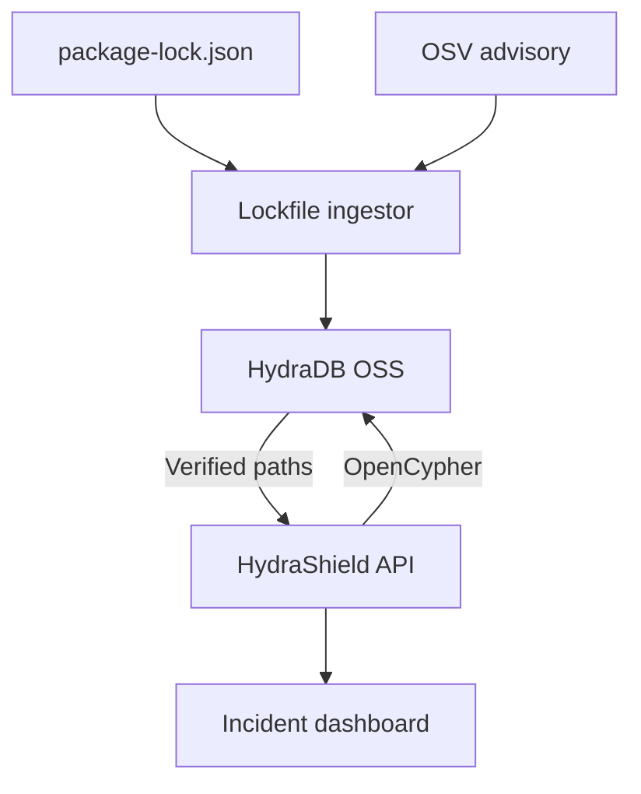

# Architecture

## Design principle

HydraDB is the source of truth for dependency topology and exposure reasoning. The application layer performs ingestion, result shaping and remediation selection; it does not maintain a shadow production graph.



## Graph schema

### Nodes

| Label | Important properties |
|---|---|
| `Application` | `id`, `name`, `environment`, `repository`, `criticality` |
| `PackageVersion` | `id`, `name`, `version`, `ecosystem` |
| `Advisory` | `id`, `package_name`, `severity`, `published_at`, `source_url` |

### Relationships

| Relationship | Meaning |
|---|---|
| `Application-[:DECLARES]->PackageVersion` | Direct dependency declared by the application |
| `PackageVersion-[:DEPENDS_ON]->PackageVersion` | Resolved version-to-version dependency |
| `Advisory-[:AFFECTS]->PackageVersion` | Exact vulnerable version evidence |

## Trusted analysis boundary

An application is exposed only when HydraDB returns a path matching:

```cypher
MATCH (adv:Advisory {id: $advisory})-[:AFFECTS]->(bad:PackageVersion)
MATCH (app:Application)-[:DECLARES]->(root:PackageVersion)
      -[:DEPENDS_ON*0..12]->(bad)
RETURN app, root, bad
```

HydraShield currently expands the variable range into fixed-depth queries so the HTTP response contains audit-friendly scalar columns for every path node. That avoids trusting an LLM or client-side reconstruction of an opaque path value.

## Remediation

For every verified path, each non-compromised package is a possible cut point. A deterministic greedy set-cover pass chooses the package upgrades that eliminate the most remaining exposure paths. Direct exposure falls back to upgrading or overriding the compromised package itself.

## Deployment modes

- `memory`: deterministic local preview and CI.
- `hydradb`: real HydraDB OSS mutations and traversal over the HTTP query endpoint.

The application behavior above the `GraphStore` contract is identical in both modes.

